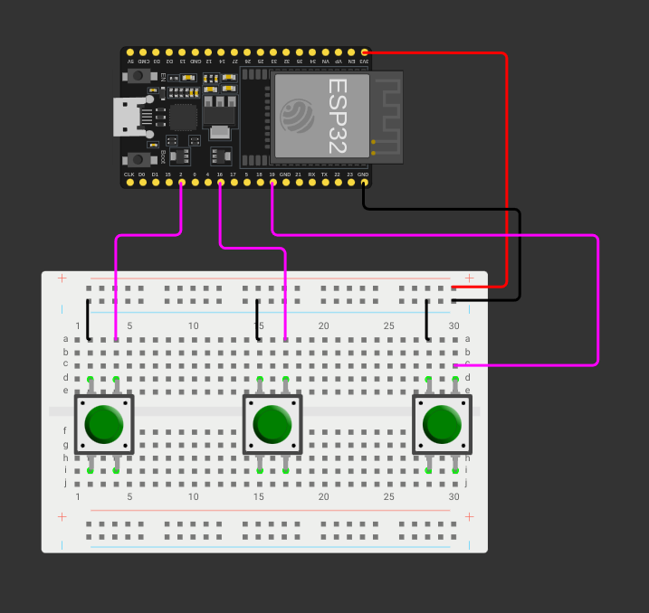

Project Progress: Cura
Author: Leopold Mistelberger
Date: 2.12.2024

== Overview
This document tracks the progress of the technical project "Cura"

* **Start Date:** 2024-11-01
* **Target Completion Date:** ???
* **Current Status:** In Progress

== Homeassistant
=== Installed Add Ons
* ESP Home
* HACS
* Mosquitto broker
* Node-RED
* Samba share
* Studio Code Server
* PostgreSQL
* WireGuard (not in use)
* Duck DNS (not in use)

=== Features
* SSH
* Static IP

== Hardware
=== Circuit Diagram

The circuit design can be viewed online at the following link:

https://wokwi.com/projects/your-project-id

The code is as simple as possible and does not contain MQTT

=== Medicine Box

== Current Focus
* Routing (VPN Wireguard, DuckDNS)
* Show MQTT data on Homeassistant

== Next Steps
1. Order Magnet Sensors
2. Impliment Sensors on medicine box
3. Prepare test cases for the core features.
