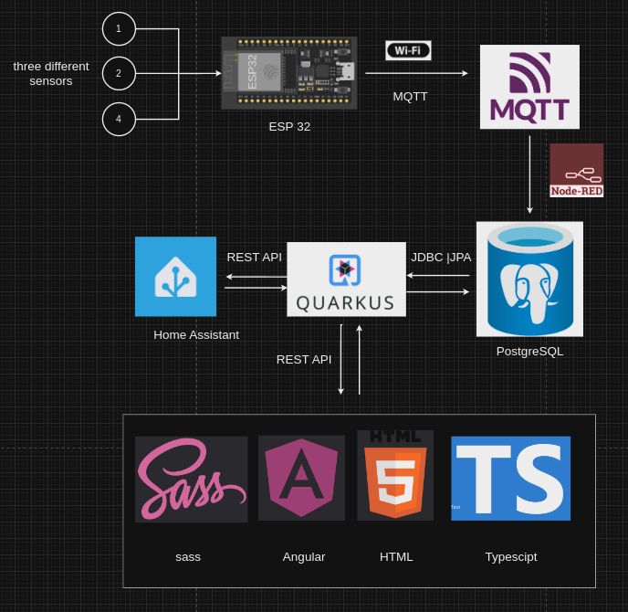
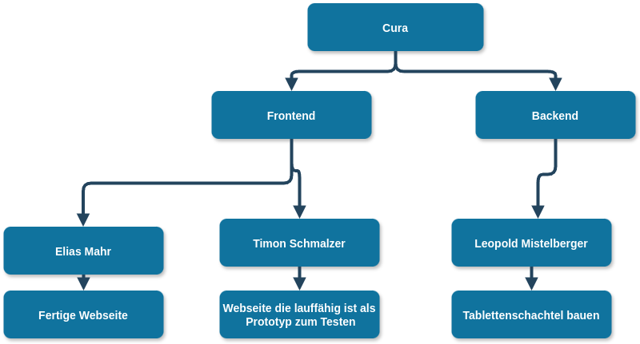
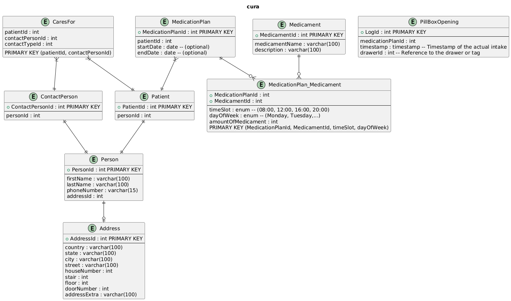
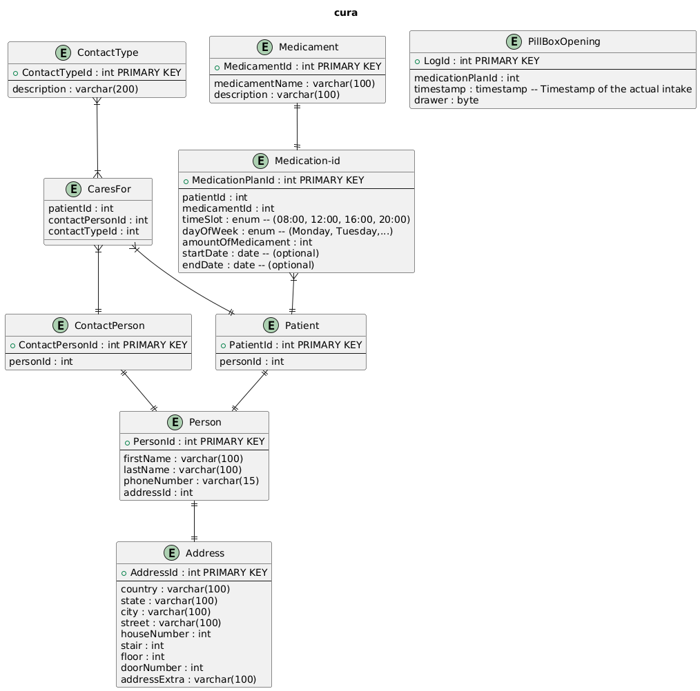
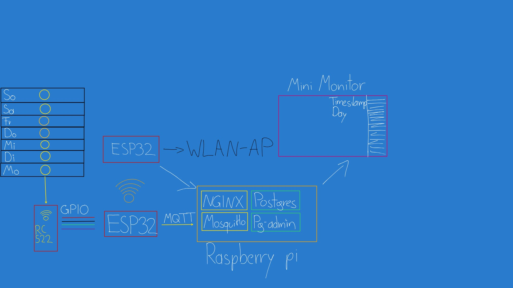
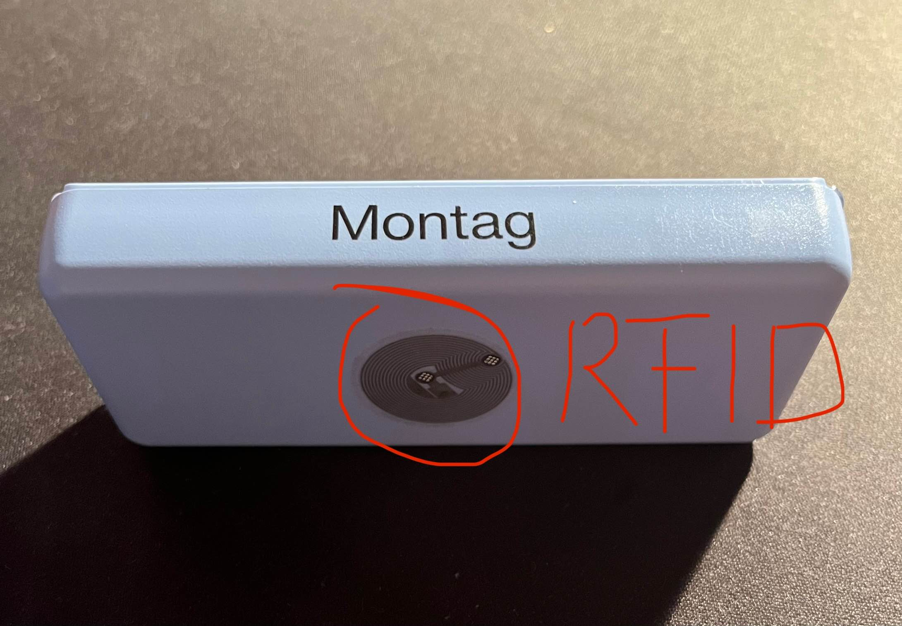
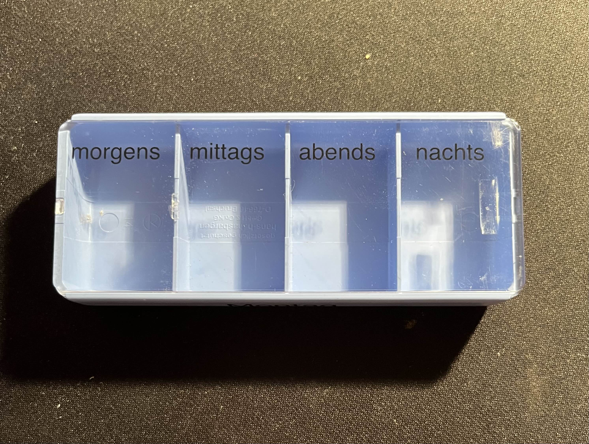
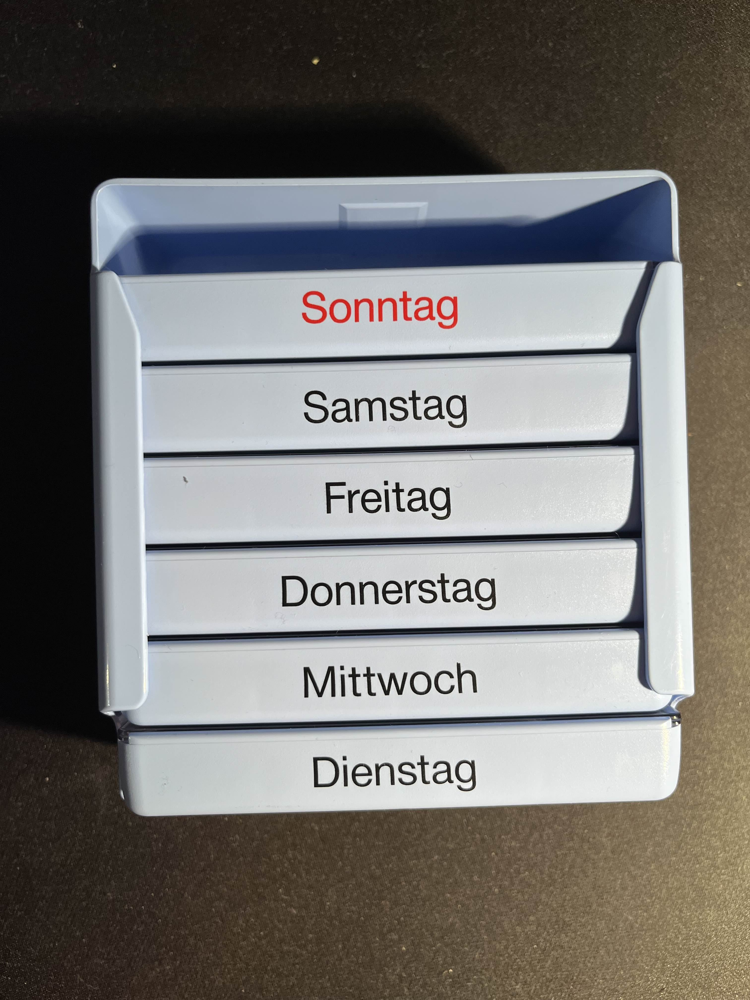
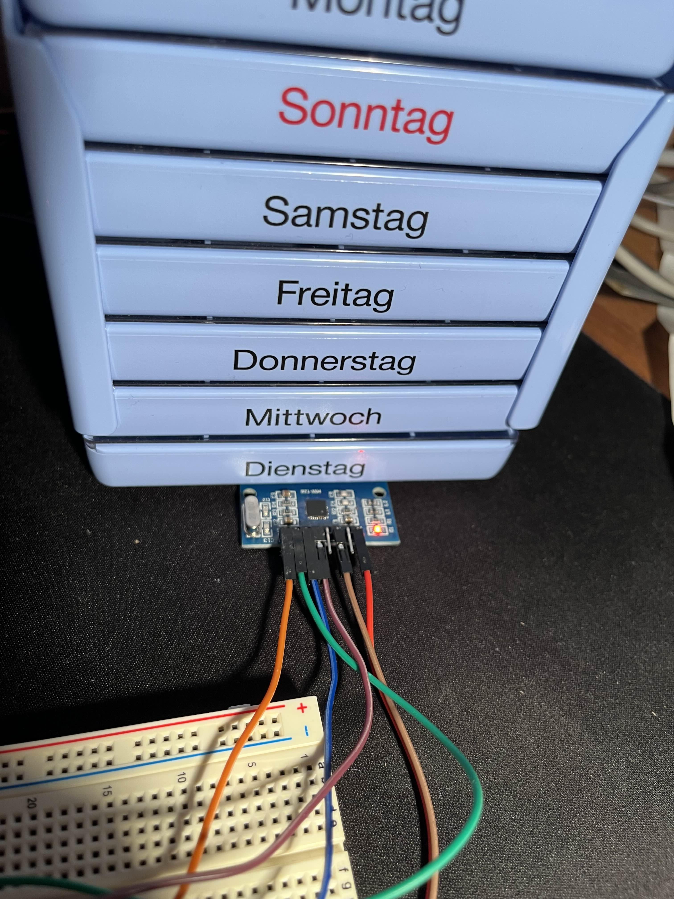

= Project Proposal: Medication Dispenser System
Author: [Leopold Mistelberger, Elias Mahr, Timon Schmalzer]
Date: [October 9, 2024]

== Cura

== Project Description
The project aims to develop an intelligent medication dispenser system that ensures patients take their medications on time.
The system monitors medication intake, sends notifications to the patient,
and, if necessary, can also notify external contacts (e.g., family members, caregivers) if the medications are not taken on time.

== Technologies
- **ESP32**: Microcontroller for detecting the status of the pillbox.
- **MQTT**: Protocol for communication between the ESP32 and the Raspberry Pi.
- **Raspberry Pi**: Central control unit hosting the database (SQL) and running Home Assistant for automation.
- **Home Assistant**: Platform for monitoring and sending notifications.
- **Database**: Stores information about medication schedules and user profiles.

["plantuml"]
plantuml::projectstructure.puml[]

== ERD
["plantuml"]
plantuml::erd.puml[]

== Update: February 3, 2025

== Projekt Beschreibung
Ziel des Projektes ist die Entwicklung eines Medikamentenverteilersystems,
das die pünktliche Einnahme der Medikamente sicherstellt. Das System überwacht die Medikamenteneinnahme
und kann bei Bedarf den Pflegefall über eine Nachricht auf dem Fernseher oder durch Geräusche aufmerksam machen.

== Organigram

[.stretch]

== Erd alt

[.stretch]

== Project Architektur alt

[.stretch]

== Erd neu

[.stretch]

== Project Architektur neu

[.stretch]

== Funktionsweise Tablettenschachtel

[.stretch]

== Funktionsweise Tablettenschachtel

[.stretch]

== Funktionsweise Tablettenschachtel

[.stretch]

== Funktionsweise Tablettenschachtel

[.stretch]
image::../../asciidocs/slides/images/img4.jpg[]

== Funktionsweise Tablettenschachtel

[.stretch]

